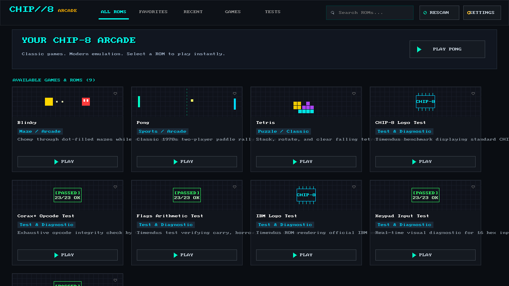
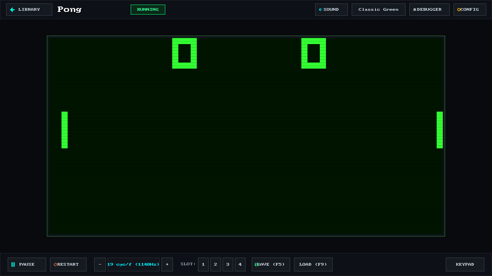
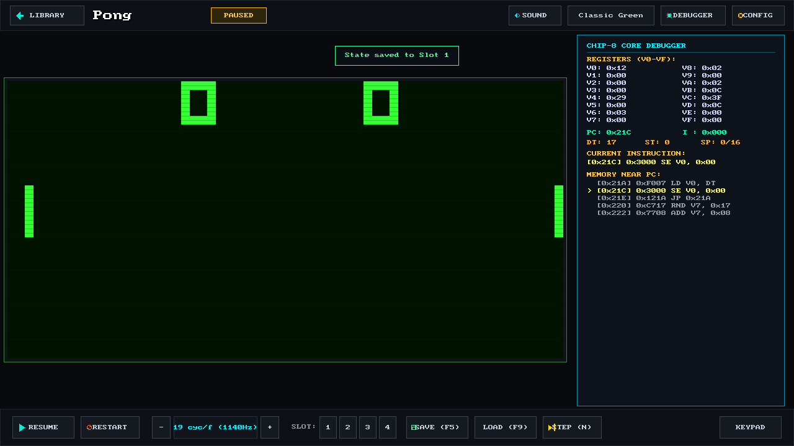
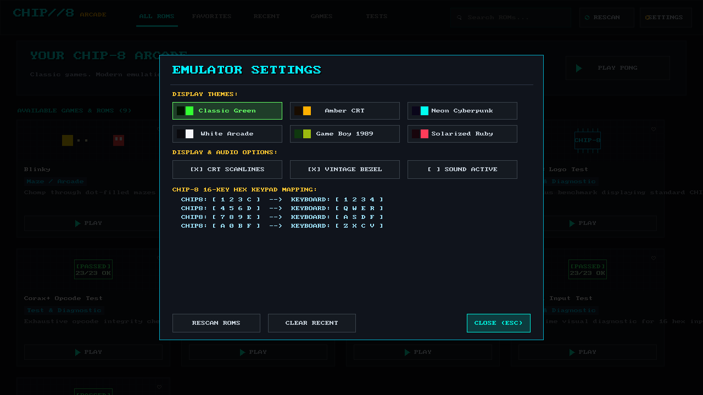
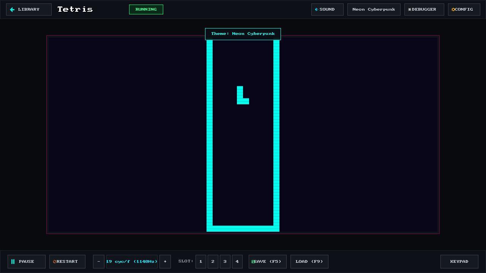
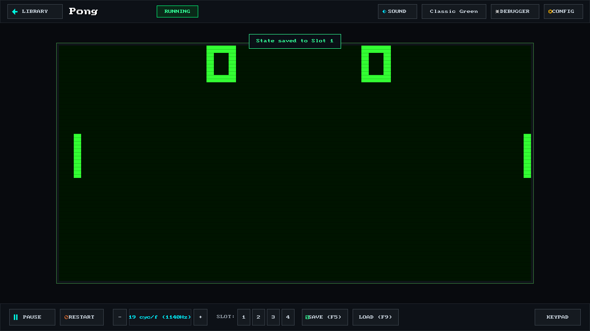

# CHIP//8 Arcade

<p align="center">
  <strong>A modern, commercial-grade CHIP-8 emulator and retro gaming platform built with C++17 and SDL2.</strong>
</p>

<p align="center">
  
  
  
  
  
</p>

---

<p align="center">
  
</p>

<p align="center">
  <em>CHIP//8 Arcade Home Library featuring dynamic ROM discovery, procedural pixel artwork, instant search, and category filters.</em>
</p>

---

## Overview

**CHIP//8 Arcade** elevates the classic 1970s CHIP-8 virtual machine into a polished, standalone desktop gaming application. Developed as a final-year software engineering project, it eliminates the need for manual command-line execution by pairing an audited, 100% specification-compliant virtual machine core with a modern dark-mode graphical launcher, procedural pixel artwork synthesizer, live runtime speed governor, multi-slot binary savestates, and an integrated real-state CPU debugger.

---

## Key Features

* 🎮 **Automatic ROM Library**: Automatically scans the `roms/` hierarchy recursively to discover and catalog `.ch8` binaries with clean titles and metadata tags.
* 🎨 **Procedural Pixel Artwork**: Renders deterministic, custom pixel graphics on game cards (court rally for *Pong*, falling tetrominoes for *Tetris*, ghost maze for *Blinky*, microchip bus for diagnostics).
* ⚡ **Runtime Speed Governor**: Real-time slider and hotkeys adjusting CPU execution from 60 Hz (1 cycle/frame) to 6,000 Hz (100 cycles/frame) with immediate effect.
* 💾 **Multi-Slot Savestates**: 4 dedicated binary savestate slots with magic header validation (`CH8S`), full system serialization, and corruption protection.
* 🐛 **Real-State CPU Debugger**: Collapsible live sidebar inspecting actual V0–VF registers in hex, Program Counter, Index register, stack levels, memory viewer, and instruction-by-instruction single stepping.
* 📺 **Display Themes & CRT Scanlines**: 6 authentic color palettes (Classic Green, Amber CRT, Neon Cyberpunk, White Arcade, Game Boy 1989, Solarized Ruby) with simulated CRT phosphor scanlines and vintage bezel glow.
* 🔎 **Instant Search & Favorites**: Live-typing search filter with persistent favorites and recently played history saved across sessions.
* 🕹️ **Visual Keyboard Mapping**: Interactive diagram illustrating the mapping between the original 16-key hex keypad and modern QWERTY keyboards.
* 🧪 **Automated Testing Suite**: 23 headless unit tests validating CPU instruction semantics, flag ordering, stack balance, and serialization round-tripping.
* 💻 **Headless CLI & Disassembler**: Full command-line support for headless batch testing (`--headless --dump-screen`) and ROM disassembly (`--disasm`).

---

## Screenshots

| ROM Library Launcher | Gameplay Screen (*Pong*) |
| :---: | :---: |
|  |  |
| *Home launcher with procedural cards & search* | *Classic rally gameplay with CRT scanlines* |

| Live CPU Debugger Sidebar | Emulator Settings & Theme Swatches |
| :---: | :---: |
|  |  |
| *Inspecting real V0-VF registers, PC, memory & step* | *Configuring display palettes, scanlines, and audio* |

| Gameplay Screen (*Tetris* — Neon Cyberpunk) | Binary Savestate Confirmation |
| :---: | :---: |
|  |  |
| *Tetris running with the Neon Cyberpunk palette* | *Instant savestate confirmation toast alert* |

---

## Architecture

CHIP//8 Arcade follows a decoupled, modular architecture where presentation, application state, and the CPU virtual machine interact via clean interfaces:

```mermaid
flowchart TD
    subgraph UI_Layer ["Presentation & UI Layer (SDL2)"]
        Launcher["ROM Library Launcher<br>• Dynamic Discovery<br>• Filter Tabs & Search<br>• Procedural Artwork"]
        GameplayScreen["Gameplay Screen<br>• 64×32 Integer Scaling<br>• CRT Scanlines & Bezel<br>• Controls Bar"]
        DebuggerPanel["Real-State Debugger<br>• Registers V0-VF<br>• PC, I, SP, Timers<br>• Disassembly & Step"]
        SettingsModal["Settings Modal<br>• 6 Color Themes<br>• Audio/CRT Toggles<br>• Keypad Mapping"]
    end

    subgraph App_State ["Application State & Persistence"]
        AppState["AppContext<br>• Screen Mode<br>• Active ROM Item<br>• Recent & Favorites"]
        Config["AppConfig<br>• chip8_config.ini<br>• Volume, Palette, Speed"]
    end

    subgraph Core ["CHIP-8 Virtual Machine (Chip8)"]
        CPU["CPU Interpreter<br>• 35 Standard Opcodes<br>• Fetch-Decode-Execute"]
        Memory["4096-Byte RAM<br>• 0x000-0x1FF: Interpreter/Fonts<br>• 0x200-0xFFF: Program Space"]
        Registers["Register File<br>• V0 to VF (8-bit)<br>• Index Register I (16-bit)<br>• Program Counter PC (16-bit)"]
        Stack["Call Stack<br>• 16-level 16-bit Stack<br>• Stack Pointer SP"]
        Timers["Timers @ 60 Hz<br>• Delay Timer (DT)<br>• Sound Timer (ST)"]
        DisplayBuf["Display Buffer<br>• 64×32 Monochrome Pixels (XOR)"]
        Keypad["16-Key Hex Keypad<br>• 0x0 through 0xF State"]
        Savestate["Savestate Engine<br>• Binary Serialization (CH8S)"]
    end

    subgraph Audio_Layer ["Audio Synthesis"]
        Audio["440 Hz Square Wave Generator<br>• 44.1 kHz 16-bit Mono Buffer"]
    end

    UI_Layer <--> App_State
    App_State --> Core
    Core --> Audio_Layer
```



For complete technical specifications, see [docs/ARCHITECTURE.md](docs/ARCHITECTURE.md).

---

## Technical Specifications

| Component | Specification | Technical Details |
| :--- | :--- | :--- |
| **System RAM** | 4,096 Bytes (4 KB) | `0x000–0x1FF` interpreter/fonts, `0x200–0xFFF` program space |
| **Registers** | 16 General (V0–VF) | 8-bit registers; `VF` doubles as arithmetic carry, borrow, and collision flag |
| **Address Register** | 1 Index (`I`) | 16-bit pointer for memory and sprite operations |
| **Program Counter** | 16-bit `PC` | Starts execution at address `0x200` |
| **Call Stack** | 16 Levels | Stores 16-bit return addresses for nested subroutines (`2nnn` / `00EE`) |
| **Timers** | 2 Timers (DT, ST) | Decrement at strictly 60 Hz independent of CPU execution cycle rate |
| **Display** | $64 \times 32$ Pixels | Monochromatic bit-matrix with XOR sprite blitting and wrap clipping |
| **Input Keypad** | 16 Hex Keys | Keys `0x0` through `0xF` with non-blocking polling and blocking wait (`Fx0A`) |
| **Sound Generator** | 440 Hz Square Wave | Synthesized in software at 44.1 kHz via SDL2 audio callback |

---

## Keyboard Controls & Keypad Mapping

### CHIP-8 16-Key Hex Keypad Mapping
```
Original 4x4 Hex Keypad:             Mapped PC Keyboard:
  [ 1 ] [ 2 ] [ 3 ] [ C ]              [ 1 ] [ 2 ] [ 3 ] [ 4 ]
  [ 4 ] [ 5 ] [ 6 ] [ D ]     ===>     [ Q ] [ W ] [ E ] [ R ]
  [ 7 ] [ 8 ] [ 9 ] [ E ]              [ A ] [ S ] [ D ] [ F ]
  [ A ] [ 0 ] [ B ] [ F ]              [ Z ] [ X ] [ C ] [ V ]
```

### Hotkey Quick Reference

| Key | Context | Function |
| :--- | :--- | :--- |
| <kbd>ESC</kbd> | Global | Close modal / Return to ROM Library / Quit application |
| <kbd>Space</kbd> / <kbd>P</kbd> | Gameplay | Pause / Resume emulation |
| <kbd>N</kbd> | Paused | Single-step execution (advances CPU by 1 instruction) |
| <kbd>C</kbd> / <kbd>Tab</kbd> | Global | Cycle display color palettes |
| <kbd>H</kbd> | Gameplay | Toggle real-time CPU debugger sidebar |
| <kbd>Ctrl</kbd> + <kbd>R</kbd> | Gameplay | Restart current game from initial ROM state |
| <kbd>+</kbd> / <kbd>-</kbd> | Gameplay | Increase / decrease CPU speed (cycles per frame) |
| <kbd>Backspace</kbd> | Gameplay | Reset CPU speed to standard 10 cycles/frame (600 Hz) |
| <kbd>F1</kbd> – <kbd>F4</kbd> | Gameplay | Select Savestate Slot 1, 2, 3, or 4 |
| <kbd>F5</kbd> | Gameplay | Save binary emulator state to active slot |
| <kbd>F9</kbd> | Gameplay | Restore binary emulator state from active slot |

---

## Build & Installation

### Prerequisites
* **C++ Compiler**: GCC (MinGW-w64 on Windows, GCC on Linux) or Clang supporting **C++17**.
* **SDL2 Library**: `libsdl2-dev` on Debian/Ubuntu, `sdl2` on Arch/Homebrew, or included SDL2 MinGW binaries on Windows.
* **Make**: GNU Make.

### Linux / macOS
```bash
# 1. Install SDL2 (Debian/Ubuntu)
sudo apt update && sudo apt install -y g++ make libsdl2-dev

# 2. Clone the repository
git clone https://github.com/Joshwin-James/chip8-emulator.git
cd chip8-emulator

# 3. Build application
make

# 4. Run CHIP//8 Arcade
./chip8
```

### Windows (PowerShell with MinGW / w64devkit)
```powershell
# 1. Clone the repository:
git clone https://github.com/Joshwin-James/chip8-emulator.git
cd chip8-emulator

# 2. Build application:
make

# 3. Launch CHIP//8 Arcade:
.\chip8.exe
```

For complete instructions and environment configuration, consult [docs/DEVELOPMENT.md](docs/DEVELOPMENT.md).

---

## Command-Line Interface (CLI)

The application supports multiple CLI flags for automation, benchmarking, and development:

```bash
# Launch interactive ROM Library Launcher (default):
./chip8

# Launch a specific ROM directly into gameplay:
./chip8 roms/Pong.ch8
./chip8 roms/Tetris.ch8

# Run in recording-friendly demo mode (20x scale, HUD active):
./chip8 roms/Pong.ch8 --demo

# Disassemble a ROM into readable assembly mnemonics:
./chip8 --disasm roms/Pong.ch8

# Run headless verification test with ASCII screen dump:
./chip8 roms/tests/1-chip8-logo.ch8 --headless --cycles 1000 --dump-screen
./chip8 roms/tests/3-corax+.ch8 --headless --cycles 2000 --dump-screen
```

---

## Automated Verification & Test Suite

The project includes an automated C++ test harness in [`tests/test_core.cpp`](tests/test_core.cpp) covering stack operations, arithmetic carry and borrow flags, shift operations, BCD math, register dumps, and savestate serialization.

```bash
# Run unit test harness:
make test
# or:
./run_tests
```

**Verified Test Results:**
```
23/23 checks passed
```

### Headless Timendus Test ROMs
The emulator passes the official Timendus CHIP-8 test suite:
1. `1-chip8-logo.ch8`: Verifies instruction execution and rendering.
2. `2-ibm-logo.ch8`: Verifies sprite drawing and XOR pixel logic.
3. `3-corax+.ch8`: Validates all 35 opcodes with passing checkmarks.
4. `4-flags.ch8`: Validates arithmetic flags and `VF` assignment ordering.
5. `5-quirks.ch8`: Evaluates platform quirks and shifting behavior.
6. `6-keypad.ch8`: Validates 16-key keypad scanning and blocking wait.

---

## Contributing

Contributions are welcome! Please review [CONTRIBUTING.md](CONTRIBUTING.md) for code style guidelines, pull request procedures, and reporting instructions.

---

## License

This project is licensed under the **MIT License**. See the [LICENSE](LICENSE) file for complete details.
