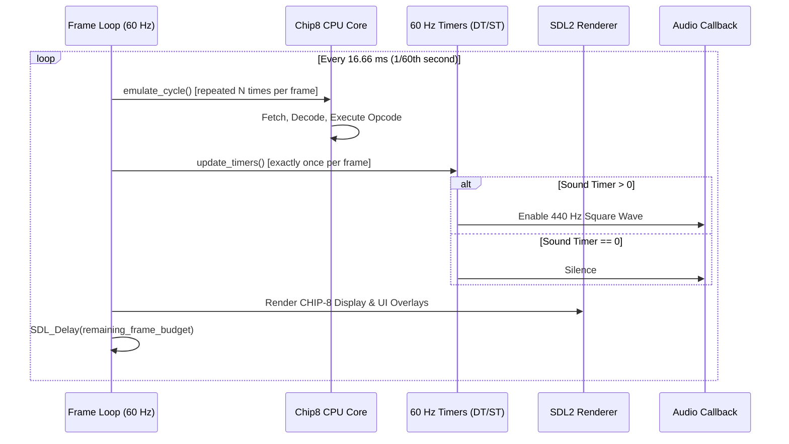

# CHIP//8 Arcade — System Architecture & Design Specification

This document provides a comprehensive technical overview of the architecture, memory model, execution cycle, rendering pipeline, and subsystems comprising **CHIP//8 Arcade**.

---

## 1. High-Level System Architecture

CHIP//8 Arcade is structured as a modular, decoupled emulator and retro gaming application built in standard **C++17** and **SDL2**. The architecture separates the virtual machine execution core from the presentation, audio synthesis, and user interface layers.

```mermaid
flowchart TD
    subgraph UI_Layer ["Presentation & UI Layer (SDL2)"]
        Launcher["ROM Library Launcher<br>• Dynamic Discovery<br>• Filter Tabs & Search<br>• Procedural Artwork"]
        GameplayScreen["Gameplay Screen<br>• 64×32 Canvas<br>• CRT Scanlines & Bezel<br>• Controls Bar"]
        DebuggerPanel["Real-State Debugger<br>• Registers V0-VF<br>• PC, I, SP, Timers<br>• Disassembly & Step"]
        SettingsModal["Settings Modal<br>• 6 Color Themes<br>• Audio/CRT Toggles<br>• Keypad Mapping"]
    end

    subgraph App_State ["Application State & Config"]
        AppState["AppContext<br>• Screen Mode<br>• Active ROM Item<br>• Recent & Favorites"]
        Config["AppConfig<br>• chip8_config.ini<br>• Volume, Palette, Speed"]
    end

    subgraph Core ["CHIP-8 Virtual Machine (Chip8)"]
        CPU["CPU Interpreter<br>• 35 Standard Opcodes<br>• Fetch-Decode-Execute"]
        Memory["4096-Byte RAM<br>• 0x000-0x1FF: Interpreter/Fonts<br>• 0x200-0xFFF: Program Space"]
        Registers["Register File<br>• V0 to VF (8-bit)<br>• Index Register I (16-bit)<br>• Program Counter PC (16-bit)"]
        Stack["Call Stack<br>• 16-level 16-bit Stack<br>• Stack Pointer SP"]
        Timers["Timers @ 60 Hz<br>• Delay Timer (DT)<br>• Sound Timer (ST)"]
        DisplayBuf["Display Buffer<br>• 64×32 Monochrome Pixels (XOR)"]
        Keypad["16-Key Hex Keypad<br>• 0x0 through 0xF State"]
        Savestate["Savestate Engine<br>• Binary Serialization (CH8S)"]
    end

    subgraph Audio_Layer ["Audio Synthesis"]
        Audio["440 Hz Square Wave Generator<br>• 44.1 kHz 16-bit Mono Buffer"]
    end

    UI_Layer <--> App_State
    App_State --> Core
    Core --> Audio_Layer
```



---

## 2. CHIP-8 Virtual Machine Core (`Chip8`)

The emulator core implements a fully compliant CHIP-8 interpreter executing the 35 standard instructions originally specified by Joseph Weisbecker in 1977.

### 2.1 Memory Map (4096 Bytes)

| Address Range | Allocation | Description |
| :--- | :--- | :--- |
| `0x000 – 0x1FF` | **512 Bytes** | Reserved for interpreter runtime and built-in 8×5 font sprites (0–F) |
| `0x200 – 0xFFF` | **3584 Bytes** | User ROM space where game binaries are loaded and executed |

### 2.2 Register Architecture
* **General-Purpose Registers (`V0` – `VF`)**: 16 8-bit data registers.
  * Register `VF` doubles as the arithmetic carry, borrow, and collision flag.
  * In all 8-series arithmetic instructions (`8xy4`, `8xy5`, `8xy6`, `8xy7`, `8xyE`), results are computed using temporary registers and assigned to `Vx` before setting `VF`, ensuring that operations where $x = \text{0xF}$ preserve the arithmetic flag.
* **Index Register (`I`)**: 16-bit address register used for memory loads, stores, and sprite draws.
* **Program Counter (`PC`)**: 16-bit register storing the address of the current instruction (initializes at `0x200`).
* **Stack Pointer (`SP`) & Stack**: 8-bit pointer tracking 16 levels of 16-bit return addresses for subroutine nesting (`2nnn` and `00EE`).

### 2.3 Instruction Cycle

Each CPU cycle follows a three-stage pipeline:

```
[FETCH]  --> Read 16-bit opcode from memory[PC] << 8 | memory[PC + 1]
[DECODE] --> Extract nibbles: op (0xF000), x (0x0F00), y (0x00F0), n (0x000F), kk (0x00FF), nnn (0x0FFF)
[EXEC]   --> Execute opcode logic, update PC, registers, display, or stack
```

---

## 3. Timing & Frame Synchronization

CHIP-8 games require a 60 Hz frame rate for display refresh and timer countdowns, but variable CPU instruction rates (typically 10 cycles/frame $\approx$ 600 Hz):



* **Timer Decoupling**: Delay Timer (`DT`) and Sound Timer (`ST`) decrement strictly at 60 Hz via `update_timers()`. They are completely decoupled from the number of CPU instructions executed.
* **Dynamic Speed Control**: The CPU loop runs $N$ cycles per 60 Hz frame ($N \in [1, 100]$), translating to an effective execution rate of 60 Hz to 6,000 Hz with immediate runtime adjustment.

---

## 4. Rendering Pipeline & CRT Simulation

1. **CHIP-8 Display Surface**:
   * Monochrome $64 \times 32$ bit buffer updated via XOR drawing opcode `Dxyn`.
   * Lit pixels are mapped to the foreground color of the selected palette; unlit pixels are mapped to the background color.
2. **Integer Pixel Scaling**:
   * The $64 \times 32$ canvas is scaled uniformly (typically $10\times$ to $14\times$) and centered within the available viewport.
3. **CRT Scanlines**:
   * Alternating horizontal scanline rasterization rendered with alpha blending (`SDL_BLENDMODE_BLEND`) simulating CRT phosphor beam scanning.
4. **Bezel Border**:
   * Translucent rounded outer frame with palette-tinted accent glow.

---

## 5. Savestate Binary Serialization Format (`CH8S`)

Savestates serialize the full emulator state into a compact binary format with format validation and corruption guards:

| Offset | Size | Type | Field | Description |
| :--- | :--- | :--- | :--- | :--- |
| `0x0000` | 4 B | `char[4]` | `Magic Header` | ASCII signature `"CH8S"` |
| `0x0004` | 2 B | `uint16_t` | `Format Version` | Format revision number (`0x0001`) |
| `0x0006` | 4096 B | `uint8_t[4096]` | `Memory` | Entire 4KB system RAM |
| `0x1006` | 16 B | `uint8_t[16]` | `Registers` | V0 through VF |
| `0x1016` | 2 B | `uint16_t` | `Index` | Index register `I` |
| `0x1018` | 2 B | `uint16_t` | `PC` | Program counter |
| `0x101A` | 32 B | `uint16_t[16]` | `Stack` | 16-level call stack |
| `0x103A` | 1 B | `uint8_t` | `SP` | Stack pointer |
| `0x103B` | 1 B | `uint8_t` | `DT` | Delay timer value |
| `0x103C` | 1 B | `uint8_t` | `ST` | Sound timer value |
| `0x103D` | 2048 B | `uint8_t[2048]` | `Display` | $64 \times 32$ screen buffer |
| `0x183D` | 16 B | `uint8_t[16]` | `Keypad` | 16 hex key states |

---

## 6. Procedural Pixel Artwork Generation

To eliminate static image dependencies while ensuring game cards look visually distinct in the launcher, `UiRenderer` features a deterministic procedural artwork synthesizer:

* **Pong**: Computes court boundaries, dashed center partition, left/right player paddles, and glowing ball with trajectory trail.
* **Tetris**: Renders authentic cyan, purple, and gold tetromino blocks stacked in a matrix grid.
* **Blinky**: Renders Pac-Man mouth angle, animated dots, and ghost sprites with eye pupils.
* **Hardware Tests**: Renders stylized microchip IC packages with circuit bus lines and `[PASSED]` verification badges.
* **Generic ROMs**: Generates arcade cabinet silhouettes with joystick and button clusters.

---

## 7. Real-State Debugger Architecture

The debugger operates directly against the running `Chip8` instance:
* **Non-Invasive Inspection**: Const public inspector getters (`get_v`, `get_pc`, `get_index`, `get_sp`, `get_stack`, `get_delay_timer`, `get_memory`) expose real hardware registers without breaking encapsulation or mutating state.
* **Disassembly Engine**: Translates raw 16-bit opcodes at `PC` and neighboring memory addresses into standard assembly mnemonics (`CLS`, `RET`, `JP`, `CALL`, `SE`, `LD`, `ADD`, `DRW`, etc.).
* **Single-Step Execution**: While paused, pressing `N` or clicking `STEP` executes exactly one instruction cycle (`emulate_cycle()`), allowing precise line-by-line inspection of game logic.
